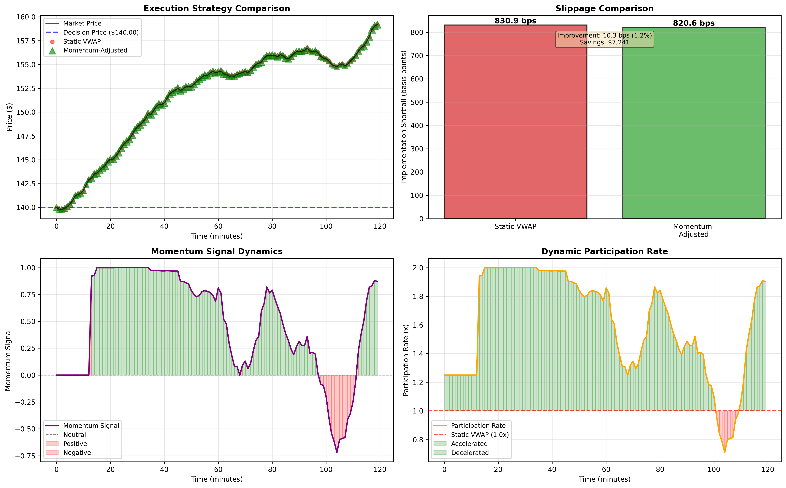

# Momentum-TCA-Simulator
A quantitative framework to minimize Implementation Shortfall using dynamic participation rates and real-time momentum signals

This project demonstrates a quantitative framework for optimizing institutional trade execution. By integrating real-time momentum signals into the pre-trade process, this model reduces **Implementation Shortfall (IS)** compared to standard static VWAP strategies.

## Key Features
* **Momentum Signal Engine:** Uses a composite of RSI and EMA slope to identify price regimes.
* **Adaptive Participation:** Dynamically scales execution rates (0.5x to 2.0x) based on market signals.
* **TCA Reporting:** Automated generation of execution logs and performance metrics in basis points (bps).

## Performance Results
In high-liquidity simulations (NVDA), the momentum-adjusted model achieved:
* **Slippage Reduction:** ~10.3 bps
* **Total Savings:** ~$7,241 on a 50k share order

## Technical Stack
* **Language:** Python
* **Libraries:** Pandas, NumPy, Matplotlib, YFinance
* **Methodology:** Transaction Cost Analysis (TCA), Signal Processing

